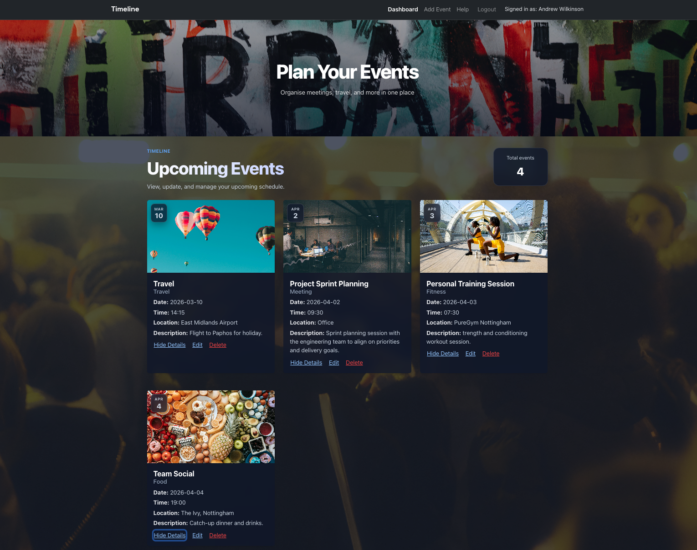
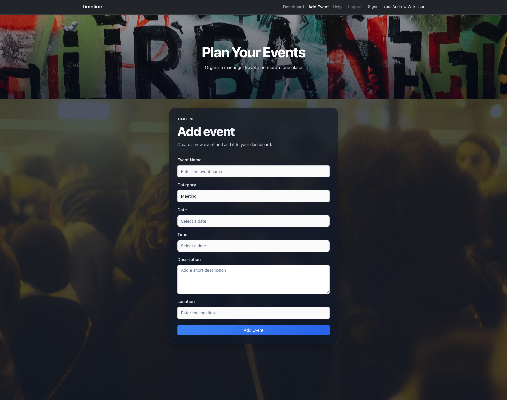

# Timeline - A React Event Planner App

A modern event planning application built with React, allowing users to manage and organise events through a clean and responsive interface.

---

## 🌐 Live Demo

https://awilkinson-qe.github.io/react-event-planner/

## 🚀 Features

- User authentication (login & registration)
- Persistent user sessions using localStorage
- Create, edit, and delete events (CRUD functionality)
- Form validation using Formik
- Event categorisation with dynamic images
- Date and time selection using React DatePicker
- Responsive UI built with React Bootstrap
- Help page with user guidance

## 🧱 Tech Stack

- React (Hooks + Context API)
- React Router
- Formik (form validation)
- React Bootstrap
- React DatePicker
- Help page with simple user guidance

## 📸 Screenshots

### Dashboard


### Add Event


## ⚙️ Installation & Setup

**1. Clone the repository:**

```bash
git clone https://github.com/awilkinson-qe/react-event-planner.git
cd react-event-planner
```

**2. Install dependencies:**

```bash
npm install
```

**3. Run the app:**

```bash
npm run dev
```

The app will be available at `http://localhost:5173`.

## 📂 Project Structure

```
src/
├── components/
├── context/
├── pages/
├── App.jsx
└── main.jsx
```

## 🔐 Authentication

- Users can register and log in
- Session data is stored using localStorage
- Protected routes prevent unauthorised access

## 📅 Event Management

- Add new events with date, time, category, and description
- Edit and delete existing events
- Events are stored locally in the browser
- Dashboard displays upcoming events in date order

## ✅ Validation

- Form validation implemented using Formik
- Required fields enforced across all forms
- Inline error messages for user feedback

## 🧠 Learning Outcomes

This project demonstrates:

- React state management using Context
- Routing and protected routes
- Form handling and validation
- Component-based architecture
- UI/UX design and responsiveness
- Persistent storage using localStorage

## 📘 Future Improvements

- Backend integration (API & database)
- User-specific event storage (multi-user support)
- Calendar view
- Notifications / reminders

## 👤 Author

Andrew Wilkinson